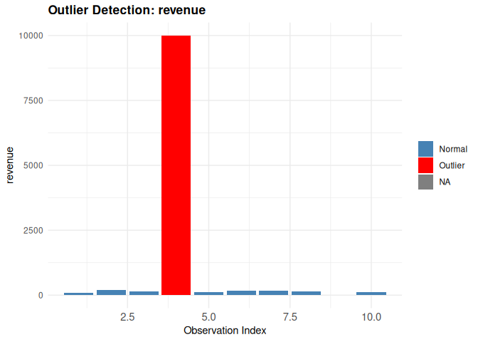

# finclean 

> A toolkit for auditing, cleaning, and visualizing messy financial
> datasets in R.

## Overview

`finclean` is an R package designed to help analysts and data scientists
clean and diagnose the messy, inconsistent data commonly found in
real-world financial datasets. It provides a set of simple but powerful
functions for parsing currency strings, standardizing fiscal year
formats, normalizing account names, detecting outliers, auditing data
quality, and visualizing anomalies — all in one place.

## Installation

You can install `finclean` directly from GitHub using the `devtools`
package:

``` r
# Install devtools if you haven't already
install.packages("devtools")
```

    ## Installing package into '/tmp/RtmpQyfG5R/temp_libpath1826f92d1ac'
    ## (as 'lib' is unspecified)

``` r
# Install finclean from GitHub
devtools::install_github("https://github.com/ADC-405-S26/finclean")
```

    ## Warning: `install_github()` was deprecated in devtools 2.5.0.
    ## ℹ Please use pak::pak("user/repo") instead.
    ## This warning is displayed once per session.
    ## Call `lifecycle::last_lifecycle_warnings()` to see where this warning was
    ## generated.

    ## Downloading GitHub repo ADC-405-S26/finclean@HEAD

    ## 
    ## ── R CMD build ─────────────────────────────────────────────────────────────────
    ## * checking for file ‘/tmp/Rtmp1Q16vA/remotes354e3e8878a0/ADC-405-S26-finclean-cb833c2/DESCRIPTION’ ... OK
    ## * preparing ‘project’:
    ## * checking DESCRIPTION meta-information ... OK
    ## * checking for LF line-endings in source and make files and shell scripts
    ## * checking for empty or unneeded directories
    ## * building ‘project_0.0.0.9000.tar.gz’
    ## Warning: invalid uid value replaced by that for user 'nobody'

    ## Installing package into '/tmp/RtmpQyfG5R/temp_libpath1826f92d1ac'
    ## (as 'lib' is unspecified)

## Functions

| Function | Description |
|----|----|
| `parse_currency()` | Converts messy currency strings like `"$1,234.56"` or `"(1,200)"` to numeric |
| `standardize_fiscal_year()` | Normalizes fiscal year formats like `"FY23"`, `"Q1 2023"`, `"2023-Q1"` into a consistent output |
| `normalize_accounts()` | Standardizes inconsistent account name variations like `"Rev."`, `"REVENUE"` → `"Revenue"` |
| `flag_outliers()` | Flags suspicious values in a numeric column using IQR or z-score method |
| `audit_report()` | Scans a data frame and returns a summary of missing values, duplicates, and outliers |
| `plot_outliers()` | Generates a bar chart highlighting outlier values in red |

## Example Usage

``` r
library(finclean)

# Load the built-in sample dataset
data(finclean_sample)

# Parse messy currency strings
parse_currency(c("$1,234.56", "EUR500", "(1,200)", "-$300.00"))
```

    ## [1]  1234.56   500.00 -1200.00  -300.00

``` r
#> [1]  1234.56   500.00 -1200.00  -300.00

# Standardize fiscal year formats
standardize_fiscal_year(c("FY23", "Q1 2023", "2023-Q2", "Q1FY23"))
```

    ## [1] "FY2023"    "FY2023-Q1" "FY2023-Q2" "FY2023-Q1"

``` r
#> [1] "FY2023"    "FY2023-Q1" "FY2023-Q2" "FY2023-Q1"

# Normalize account name variations
normalize_accounts(c("Rev.", "REVENUE", "Expenses", "EXP", "Net Inc."))
```

    ## [1] "Revenue"    "Revenue"    "Expenses"   "Expenses"   "Net Income"

``` r
#> [1] "Revenue"    "Revenue"    "Expenses"   "Expenses"   "Net Income"

# Flag outliers using IQR method
flag_outliers(c(100, 200, 150, 10000, 130, 170))
```

    ##   value is_outlier
    ## 1   100      FALSE
    ## 2   200      FALSE
    ## 3   150      FALSE
    ## 4 10000       TRUE
    ## 5   130      FALSE
    ## 6   170      FALSE

``` r
#>   value is_outlier
#> 1   100      FALSE
#> 2   200      FALSE
#> 3   150      FALSE
#> 4 10000       TRUE
#> 5   130      FALSE
#> 6   170      FALSE

# Generate a full data quality audit report
audit_report(finclean_sample)
```

    ##     column      type n_missing pct_missing n_duplicates n_outliers
    ## 1   period character         0           0            0         NA
    ## 2  account character         0           0            0         NA
    ## 3   amount character         0           0            0         NA
    ## 4  revenue   numeric         1          10            0          1
    ## 5 expenses   numeric         0           0            2          1

``` r
#>    column      type n_missing pct_missing n_duplicates n_outliers
#> 1  period character         0           0            0         NA
#> 2 account character         0           0            0         NA
#> 3  amount character         0           0            0         NA
#> 4 revenue   numeric         1          10            0          1
#> 5 expenses   numeric         0           0            2          1

# Visualize outliers in a column
plot_outliers(finclean_sample, column = "revenue")
```

    ## Warning: Removed 1 row containing missing values or values outside the scale range
    ## (`geom_bar()`).

<!-- -->

## Dataset

`finclean` includes a built-in sample dataset `finclean_sample` — a
small data frame containing common data quality issues found in
real-world financial data, including inconsistent fiscal year formats,
account name variations, messy currency strings, outliers, and missing
values.

``` r
data(finclean_sample)
head(finclean_sample)
```

    ##    period  account    amount revenue expenses
    ## 1    FY23     Rev. $1,234.56     100       50
    ## 2 Q1 2023  REVENUE      €500     200       80
    ## 3 2023-Q2 Expenses   (1,200)     150      200
    ## 4  Q1FY23      EXP  -$300.00   10000       60
    ## 5  FY2023 Net Inc.   $98,000     130       90
    ## 6 Q3-2023     COGS    $1,500     170       50

| period  | account  | amount     | revenue | expenses |
|---------|----------|------------|---------|----------|
| FY23    | Rev.     | \$1,234.56 | 100     | 50       |
| Q1 2023 | REVENUE  | EUR500     | 200     | 80       |
| 2023-Q2 | Expenses | (1,200)    | 150     | 200      |
| Q1FY23  | EXP      | -\$300.00  | 10000   | 60       |
| FY2023  | Net Inc. | \$98,000   | 130     | 90       |
| Q3-2023 | COGS     | \$1,500    | 170     | 50       |

## Dependencies

- [`checkmate`](https://cran.r-project.org/package=checkmate) — input
  validation
- [`ggplot2`](https://ggplot2.tidyverse.org/) — visualization
- [`rlang`](https://rlang.r-lib.org/) — tidy evaluation utilities

## License

MIT © 2025
