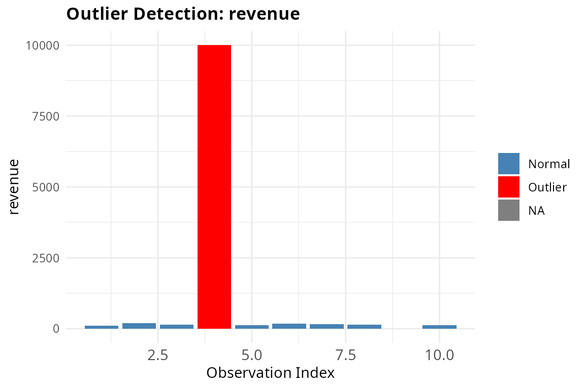

# Introduction to finclean package

``` r
library(finclean)
```

## What is finclean?

`finclean` is an R package that helps you clean and diagnose messy
financial data. Real-world financial datasets often have inconsistent
formats, missing values, and suspicious entries that need to be
addressed before any analysis. This vignette walks through each function
using the built-in sample dataset.

## Load the Dataset

`finclean` comes with a built-in sample dataset `finclean_sample` that
contains common data quality issues found in financial data — messy
currency strings, inconsistent fiscal year formats, account name
variations, outliers, and missing values.

``` r
data(finclean_sample)
finclean_sample
#>     period       account      amount revenue expenses
#> 1     FY23          Rev.   $1,234.56     100       50
#> 2  Q1 2023       REVENUE        €500     200       80
#> 3  2023-Q2      Expenses     (1,200)     150      200
#> 4   Q1FY23           EXP    -$300.00   10000       60
#> 5   FY2023      Net Inc.     $98,000     130       90
#> 6  Q3-2023          COGS      $1,500     170       50
#> 7     2024 cost of goods      $2,000     160       75
#> 8     FY24        assets $99,999,999     140       65
#> 9  Q2 2024          CASH    (750.00)      NA       85
#> 10  Q4FY24        Equity      $3,200     120       55
```

## Parse Currency Strings

Financial data often contains currency values stored as strings with
symbols, commas, and parentheses.
[`parse_currency()`](https://adc-405-s26.github.io/finclean/reference/parse_currency.md)
converts these into clean numeric values. Parentheses-style negatives
like `"(1,200)"` are correctly converted to `-1200`.

``` r
parse_currency(finclean_sample$amount)
#>  [1]     1234.56      500.00    -1200.00     -300.00    98000.00     1500.00
#>  [7]     2000.00 99999999.00     -750.00     3200.00
```

## Standardize Fiscal Year Formats

Fiscal year labels are often inconsistent across teams and systems.
[`standardize_fiscal_year()`](https://adc-405-s26.github.io/finclean/reference/standardize_fiscal_year.md)
normalizes all formats into a consistent `FY####` or `FY####-Q#` output.

``` r
standardize_fiscal_year(finclean_sample$period)
#>  [1] "FY2023"    "FY2023-Q1" "FY2023-Q2" "FY2023-Q1" "FY2023"    "FY2023-Q3"
#>  [7] "FY2024"    "FY2024"    "FY2024-Q2" "FY2024-Q4"
```

## Normalize Account Names

Account names are frequently abbreviated or capitalized differently by
different people.
[`normalize_accounts()`](https://adc-405-s26.github.io/finclean/reference/normalize_accounts.md)
maps all variations to a single standardized label. Note that if you
supply a `custom_map`, it will completely replace the built-in mapping.

``` r
normalize_accounts(finclean_sample$account)
#>  [1] "Revenue"    "Revenue"    "Expenses"   "Expenses"   "Net Income"
#>  [6] "COGS"       "COGS"       "Assets"     "Cash"       "Equity"
```

## Flag Outliers

[`flag_outliers()`](https://adc-405-s26.github.io/finclean/reference/flag_outliers.md)
detects suspicious values in a numeric column using either the IQR
method (default) or the z-score method. It returns a data frame with
each value labeled as an outlier or not.

``` r
flag_outliers(finclean_sample$revenue)
#>    value is_outlier
#> 1    100      FALSE
#> 2    200      FALSE
#> 3    150      FALSE
#> 4  10000       TRUE
#> 5    130      FALSE
#> 6    170      FALSE
#> 7    160      FALSE
#> 8    140      FALSE
#> 9     NA         NA
#> 10   120      FALSE
```

## Audit the Full Dataset

Instead of checking each column individually,
[`audit_report()`](https://adc-405-s26.github.io/finclean/reference/audit_report.md)
scans the entire data frame at once and returns a structured summary of
missing values, duplicate counts, and outliers for every column.

``` r
audit_report(finclean_sample)
#>     column      type n_missing pct_missing n_duplicates n_outliers
#> 1   period character         0           0            0         NA
#> 2  account character         0           0            0         NA
#> 3   amount character         0           0            0         NA
#> 4  revenue   numeric         1          10            0          1
#> 5 expenses   numeric         0           0            2          1
```

## Visualize Outliers

[`plot_outliers()`](https://adc-405-s26.github.io/finclean/reference/plot_outliers.md)
generates a bar chart that highlights outlier observations in red,
making it easy to spot anomalies at a glance.

``` r
plot_outliers(finclean_sample, column = "revenue")
#> Warning: Removed 1 row containing missing values or values outside the scale range
#> (`geom_bar()`).
```


